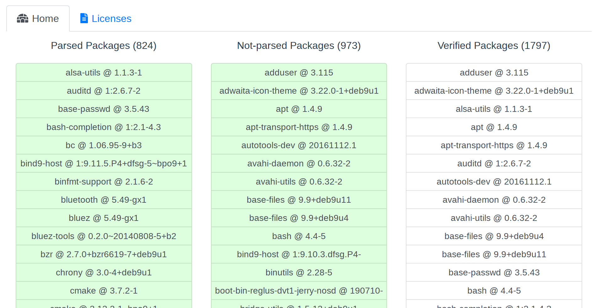
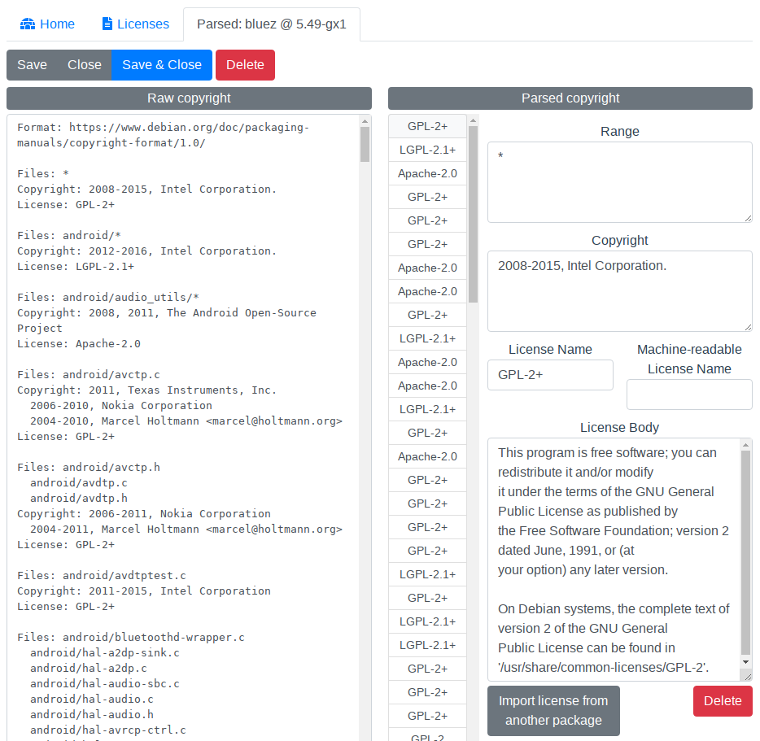

ligath - LIcence GATHerer
=========================

Ligath is a collection of software to help you aggregate copyright notices of software installed in Debian-like distributions.
This lets you know what licenses are adopted in installed Debian packages by analyzing `copyright` file.

The result of analysis is packed into a JSON and ready to be visualized via a frontend.
You may find that not all packages are correctly analyzed but don't worry; The frontend has an Edit View to correct them.

Expected use-cases are:

 - Find licenses and packages to accept / reject
 - Discuss a license with the law department in your company
 - Export a concatenated LICENSE file and publish it to public

# Disclaimer

Ligath is not that clever like Black Duck, FOSSology and WhiteSource;
it just analyzes `copyright` files and show the result with some lists.
It does not do source-code level analysis.

It has neither a well-known license database nor explanations to them.

Ligath does NOT provide you any legal advices.

See also: [LICENSE](LICENSE)

# Supported Platforms

 - Debian 9 (Stretch)

# Tools

For further information, see individual README.md in each directory.

## `ligath/collect_apt`

Collects and analyzes `copyright` files of Debian packages.

## `ligath/frontend`

A frontend to list / read / verify / aggregate copyright notices. It aims to help multiple persons to classify and filter copyrights in parallel.

## `ligath/backend`

An endpoint that serves the frontend and an HTTP API. It persists license metadata in [BoltDB](https://github.com/boltdb/bolt).

Instruction
===========

1. [Gather copyright files on a target machine](#gather-copyright-files-on-a-target-machine)
2. [Load gathered copyright files into the backend](#load-exported-json-into-the-backend)
3. [View and edit copyright notices](#view-and-edit-copyright-notices)
4. [Export as list](#export-as-list)

Gather copyright files on a target machine
------------------------------------------

1. Install Python 3 into the machine
    - Works with 3.5+ (verified), maybe 3.3+ (not verified)
    - `apt install python3 python3-venv python3-pip` is enough in most cases
2. Deploy `collect_apt` directory into the machine with `scp` or equivalents
3. Prepare a venv
    - `bootstrap.sh` prepares a venv with requirements
4. Run `collect_apt`
    - `source ./env/bin/activate && python3 -m collect_apt`
3. Ensure that `YYMMDD.json` is generated

Now you're ready to load it into the backend.

Load exported JSON into the backend
------------------------------

1. Build the backend
    - `$ make -C backend setup`
    - `$ make -C backend build`
2. Launch the backend with the JSON
    - IMPORTANT: please run the backend in the repository root or you'll be warned
    - `$ ./backend/ligath serve -j YYMMDD.json`
    - The JSON will be *migrated* into the DB; see [Mechanism](#mechanism) section for detailed behavior
3. Visit `localhost:3939` with your favorite web browser and ensure it's working

View and edit copyright notices
-------------------------------

Please visit `localhost:3939` and view some packages. You'll notice that some packages have structured &
easy-to-read copyright notices while others don't.

It's because of the format of copyright files. `collect_apt` tool parses a copyright file and checks if it complies with
[Machine-readable Copyright File](https://www.debian.org/doc/packaging-manuals/copyright-format/1.0/) format.
If it surely is machine-readable, it will get parsed and structured copyright notices will be available in the frontend.

The frontend helps you parse the raw copyright file manually. Of course, you can also edit the parsed copyright notices.

### Parsed Packages

The left column lists all parsed packages. They may have structured copyright notices.
Please be careful that some of them might have incorrect copyright notices. That's why we have the Parsed Packages
column and the Verified Packages column separately.

Click items to view the raw copyright text and parsed copyright notices. Verified packages are painted green.

### Non-parsed Packages

These packages have old-styled, non-machine-readable copyright files. Manual parse is required to collect copyright
notices and know what kind of OSS license is adopted in the package.

Click items to view the raw copyright text and parse it manually. Verified packages are painted green.

### Package view

This view lets you view and edit copyright notices. Above screenshot shows Bluez for example.

The left column, "Raw copyright", shows the original content of `/usr/share/doc/bluez/copyright` .

The right column, "Parsed copyright", shows the parsed content of copyright file.

Correct the content of right column by clicking items in the license list and editing input fields.

Non-parsed packages have no parsed copyrights in the first state.
Click "+ Add new notice" to add a new notice and fill input fields.

Click "Save" or "Save & Close" saves the package and input copyrights into DB. Saved packages are called
"Verified Packages" and will be shown in the rightmost column in the Home View.
Thus, there's no way to overwrite non-parsed or parsed packages. It's mainly for safety.

Export as list
--------------

Run `./backend ligath export human LICENSES.txt` to export all verified packages' raw copyrights.

Mechanism
=========

Exported JSONs from `collect_apt` tool contains raw copyright text and
parsed copyright notices for each Debian packages.

The JSONs are migrated by the backend and the packages in JSONs are saved in two buckets: parsed and non-parsed.
The former is saved in `{JSON file name}_parsed`
and the latter is saved in `{JSON file name}_notparsed`.

When users saves manually parsed / verified packages, they are saved in `verified` bucket.
`ligath export` reads packages from the `verified` bucket.

